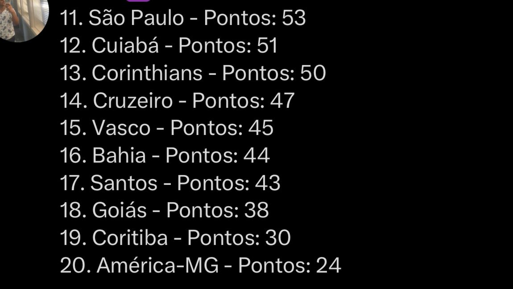

<h1 align="center"> Automatic-Table </h1>

  <a href="#-Technologies">Technologies</a>&nbsp;&nbsp;&nbsp;|&nbsp;&nbsp;&nbsp;
  <a href="#-Project">Project</a>&nbsp;&nbsp;&nbsp;|&nbsp;&nbsp;&nbsp;

 

## 🔍 Technologies

This project was developed with the following technologies:

Python

## 🎓 Learning

 This project was created in order to delve a little deeper into automation using the twitter API and also with other technologies such as panda and scrapy and the time function of the Python Language

## 💻 Project

In this project I use scrapy to scrape the table of the Brasileirão that returns the information such as points, goals and turns them into an excell file and I use the Twitter API to create a bot that posts this table for me automatically in the finished time that is chosen.

---
